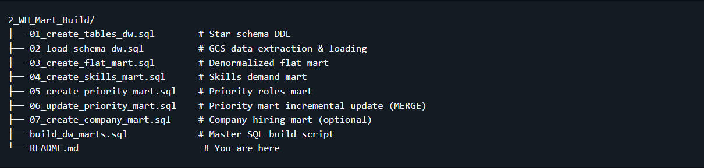

# Data Warehouse & Mart Build: Production ETL Pipeline
An end-to-end data engineering pipeline that transforms raw CSV files from Google Cloud Storage into a normalized star schema data warehouse, then builds analytical data marts.

## 🧾 Executive Summary (For Hiring Managers)

- ✅ Pipeline scope: Built a complete ETL pipeline from raw CSVs to star schema warehouse to analytical marts
- ✅ Data modeling: Designed a star schema with fact tables, dimensions, and bridge tables for many-to-many relationships
- ✅ ETL development: Implemented extract, transform, load processes with idempotent operations and data quality checks
- ✅ Mart architecture: Created specialized data marts (flat, skills, priority) with additive measures and incremental update patterns

## 🧩 Problem & Context

Raw job posting data arrives as flat CSV files in Google Cloud Storage—not structured for analytical queries. Analysts need to answer:

- Which skills are most in-demand over time?
- What are hiring trends by company and location?
- How do salary patterns vary by role and skill?

**Challenge**: Data teams need a single source of truth system—a data warehouse—to enable consistent, reliable analysis across the organization. Additionally, specialized data marts are required to optimize resources by pre-aggregating data for specific business use cases, reducing query complexity and improving performance for common analytical patterns.

**Solution**: End-to-end ETL pipeline that extracts CSVs from cloud storage, normalizes them into a star schema warehouse (separating facts from dimensions), and creates specialized data marts optimized for specific use cases (flat queries, skill demand analysis, priority role tracking).

## 🧰 Tech Stack

-  Database: DuckDB (file-based OLAP database with GCS integration via httpfs)
- 🧮 Language: SQL (DDL for schema design, DML for data loading and transformation)
- 📊 Data Model: Star schema (fact + dimension + bridge tables)
- 🛠️ Development: VS Code for SQL editing + Terminal for DuckDB CLI execution
- 🔧 Automation: Master SQL script for pipeline orchestration
- 📦 Version Control: Git/GitHub for versioned pipeline scripts
- ☁️ Storage: Google Cloud Storage for source CSV files

## Pipeline Architecture

The pipeline transforms job posting CSVs from Google Cloud Storage into a normalized star schema data warehouse, then builds specialized analytical data marts. BI tools (Excel, Power BI, Tableau, Python) consume from both the warehouse and marts.

## Data Warehouse

The data warehouse implements a star schema with company_dim, skills_dim, job_postings_fact, and skills_job_dim tables.

- **SQL Files:**

1. DW_Tables.sql – Defines star schema with 4 core tables
2. DW_load_schema.sql – Extracts CSVs from GCS and loads into warehouse tables
- **Purpose:** Star schema serving as single source of truth for analytical queries
- **Grain:** One row per job posting in the fact table (job_postings_fact)

## Flat Mart

Denormalized table with all dimensions for ad-hoc queries.

- **SQL File:** Flat_Mart.sql – Builds denormalized table with all dimensions joined
**Purpose:** Denormalized table for quick ad-hoc queries
**Grain:** One row per job posting with all dimensions joined

## Skills Mart

Time-series skill demand analysis with additive measures.

**SQL File:** Skills_Mart.sql – Builds time-series skill demand mart
**Purpose:** Time-series analysis of skill demand over time with additive measures.
**Grain:** skill_id + month_start_date + job_title_short
**Key Features:** All measures are additive (counts/sums) for safe re-aggregation
## Priority Mart

Priority role tracking with incremental updates using MERGE operations.

- SQL Files:
1. 05_create_priority_mart.sql – Initial build of priority roles and jobs snapshot
2. 06_update_priority_mart.sql – Incremental update using MERGE (upsert pattern)
- Purpose: Track priority roles and job snapshots with incremental update capabilities
- Grain: One row per job posting with priority level assignment
- Key Features: MERGE operations for incremental updates - demonstrates production-ready upsert patterns (INSERT, UPDATE, DELETE in single statement)

## Company Mart (Optional)
Company hiring trends by role, location, and month.

- **SQL File:** 07_create_company_mart.sql – Builds company hiring trends mart.
- **Purpose**: Company hiring trends analysis by role, location, and month.
**Grain:** company_id + job_title_short_id + location_id + month_start_date. 
**Key Features:** Bridge tables for many-to-many relationships (company-location, job title hierarchies)
Note: This mart is optional and can be skipped if not needed